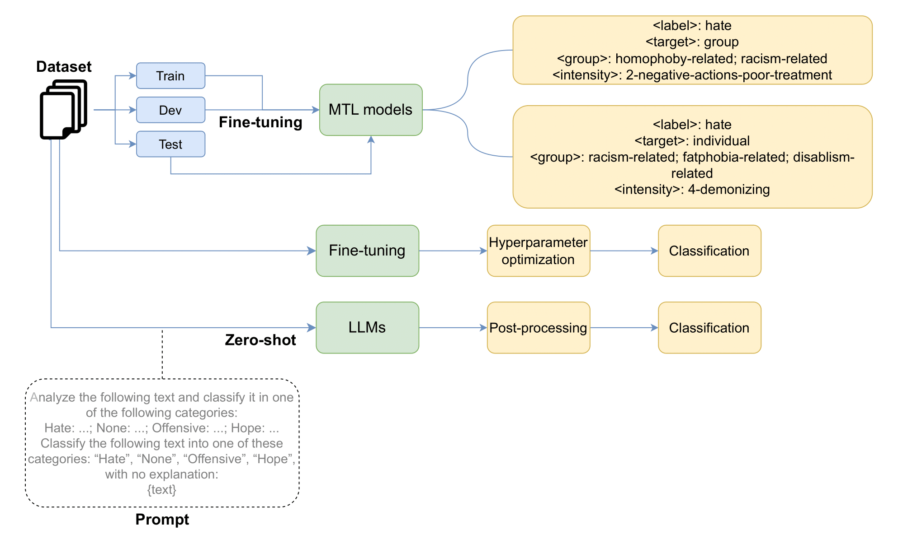

# MTLHateCorpus 2023
## Multi-task Learning for Hate Speech Detection: Identifying Speech Type, Target, Targeted-group, and Intensity in Spanish
https://www.sciencedirect.com/science/article/pii/S0920548925000194

### TL-DR: Highlights
- Creation of a Spanish corpus for fine-grained hate speech recognition.
- Four subtasks: hate speech type, target, target group and intensity.
- Evaluation of three LLMs using Zero-Shot Learning as a lower bound baseline and by fine tuning with different LLMs as strong baseline.
- Evaluation of mBART using a multitask learning approach to solve all tasks at once.
- MTL learning with mBART showed competitive results, but its performance is slightly below the fine-tuning approach.

### Authors
- **Ronghao Pan** — University of Murcia  
  [Google Scholar](https://scholar.google.com/citations?user=80lntLMAAAAJ&hl=en) · [ORCID](https://orcid.org/0009-0008-7317-7145)

- **José Antonio García-Díaz** — University of Murcia  
  [Google Scholar](https://scholar.google.com/citations?user=ek7NIYUAAAAJ&hl=en) · [ORCID](https://orcid.org/0000-0002-3651-2660)

- **Rafael Valencia-García** — University of Murcia  
  [Google Scholar](https://scholar.google.com/citations?user=GLpBPNMAAAAJ&hl=en) · [ORCID](https://orcid.org/0000-0003-2457-1791)

> Affiliation:  
> *Department of Computer Science and Systems, Universidad de Murcia, Spain.*

### Publication
This article was published in *Computer Standards & Interfaces*, Volume 94, August 2025, Article 103990.  
**DOI:** https://doi.org/10.1016/j.csi.2025.103990  
**Publisher page:** https://www.sciencedirect.com/science/article/pii/S0920548925000194

### Abstract
The rise of digital communication has exacerbated the challenge of detecting abusive language, particularly hate speech, across online platforms. This work presents **Spanish MTLHateCorpus 2023**, a newly curated multi-task dataset designed to address four key subtasks:

1. **Speech Type Identification**  
2. **Target Detection** (individual vs. group)  
3. **Target Group Classification**  
4. **Hate Speech Intensity**

We explore multi-task learning architectures to jointly learn these subtasks and assess whether shared representations lead to improved performance across all dimensions of hate-speech analysis. The results demonstrate that MTL models outperform single-task baselines in several metrics, confirming the relevance of joint learning for complex abusive-language problems.

### Dataset
To request the dataset, please fill this form:
```
https://docs.google.com/forms/d/e/1FAIpQLSeqvkrt757WXvjSbtswQ3Uw6_wOmL3Mp-vddM3pDjBOPQw3Pg/viewform?usp=dialog
```

You will receive instructions by email after validating research use.

#### Speech Type Distribution
This subtask classifies each instance into one of four categories: hate, hope, offensive, or none.

| label                             | train | val  | test | total |
|-----------------------------------|------:|-----:|-----:|------:|
| hate                              | 8419  | 1804 | 1805 | 12028 |
| hope                              | 1840  | 395  | 395  | 2630  |
| none                              | 7545  | 1617 | 1617 | 10779 |
| offensive                         | 7025  | 1505 | 1506 | 10036 |
| total                             | 24829 | 5321 | 5323 | 35473 |

#### Target Identification (Individual vs. Group)
This subtask indicates whether the hate speech is directed at an individual, a group, or if no target is present.

| label                             | train | val  | test | total |
|-----------------------------------|------:|-----:|-----:|------:|
| group                             | 7451  | 1588 | 1650 | 10689 |
| individual                        | 9852  | 2116 | 2062 | 14030 |
| none                              | 7526  | 1617 | 1611 | 10754 |
| total                             | 24829 | 5321 | 5323 | 35473 |

#### Target Group Category
This subtask assigns a semantic category to the target when the instance contains hate against a group. 
This is a multi-label task. There are 9 target group categories, plus a “safe” label for non-hateful content.

```
⚠️ Note: This task includes 43,632 annotations because instances without a target group may still be included as safe, depending on the annotation protocol.
```

| label                             | train | val  | test | total |
|-----------------------------------|------:|-----:|-----:|------:|
| aporophobia                       | 498   | 90   | 121  | 709   |
| disablism                         | 158   | 39   | 34   | 231   |
| fatphobia                         | 4648  | 977  | 1008 | 6633  |
| homophoby                         | 11785 | 2536 | 2547 | 16868 |
| misogyny                          | 1360  | 280  | 290  | 1930  |
| profession                        | 940   | 212  | 200  | 1352  |
| racism                            | 4161  | 862  | 952  | 5975  |
| safe                              | 2130  | 458  | 424  | 3012  |
| transphoby                        | 4844  | 1067 | 1011 | 6922  |
| total                             | 30524 | 6521 | 6587 | 43632 |

#### Hate Speech Intensity
Intensity is annotated on a 6-level ordinal scale:
1. Disagreement
2. Negative actions / poor treatment
3. Negative character insults
4. Demonizing content
5. Violence
6. Death threats,
7. plus none for non-hateful content.

| label                             | train | val  | test | total |
|-----------------------------------|------:|-----:|-----:|------:|
| 1-disagreement                    | 2305  | 470  | 505  | 3280  |
| 2-negative-actions-poor-treatment | 4408  | 882  | 915  | 6205  |
| 3-negative-character-insults      | 7151  | 1610 | 1582 | 10343 |
| 4-demonizing                      | 1168  | 266  | 222  | 1656  |
| 5-violence                        | 329   | 73   | 76   | 478   |
| 6-death                           | 87    | 9    | 17   | 113   |
| none                              | 9381  | 2011 | 2006 | 13398 |
| total                             | 24829 | 5321 | 5323 | 35473 |

### System architecture


### Evaluation
Next, this table summarizes the best macro-F1 score obtained for each subtask, comparing the best single-task fine-tuning model against the best multi-task learning (MTL) model. Results are taken from Tables 6, 8, 10, and 12 of the paper.

| Task                                 | Best fine-tuning model | Best fine-tuning F1 | Best MTL model | Best MTL F1 |
|--------------------------------------|------------------------|--------------------:|----------------|------------:|
| Type of speech                       | ENSEMBLE               | **63.350**          | mBART          | 59.331      |
| Target (individual vs. group)        | ENSEMBLE               | **71.091**          | mBART          | 67.040      |
| Targeted group                       | MarIA                  | **63.966**          | mBART          | 62.908      |
| Hate speech intensity                | BETO                   | **48.648**          | T5             | 45.555      |

Although single-task fine-tuning achieves the highest macro-F1 scores in all subtasks, the multi-task learning (MTL) models obtain competitive performance while jointly addressing the four dimensions of hate speech: speech type, target, target group, and intensity. The performance drop between the best fine-tuned and MTL models remains relatively small across tasks, suggesting that shared representations can generalize well without severely sacrificing accuracy. Importantly, a single multi-task model is able to solve all subtasks simultaneously, offering a more compact, efficient, and scalable alternative for real-world deployment.


### Acknowledgments
This research is part of the project LT-SWM (TED2021-131150B-I00), funded by the Spanish Ministry of Science and Innovation, the State Research Agency (MCIN/AEI/10.13039/501100011033), and the European Union through the NextGenerationEU Recovery Plan. Additional support was provided by the “Programa de incentivos para la realización de proyectos de investigación para jóvenes doctores en temas de inteligencia artificial aplicada al sector agrario, medioambiental o energético y la lucha contra la despoblación y el reto demográfico” (CARTAGO-APP), and the research project “Automatic Political Awareness for Political Microtargeting” (22252/PDC/23) funded by the Autonomous Community of the Region of Murcia.

## Citation
```
@article{pan2025spanish,
  title={Spanish MTLHateCorpus 2023: Multi-task learning for hate speech detection to identify speech type, target, target group and intensity},
  author={Pan, Ronghao and Garc{\'\i}a-D{\'\i}az, Jos{\'e} Antonio and Valencia-Garc{\'\i}a, Rafael},
  journal={Computer Standards \& Interfaces},
  volume={94},
  pages={103990},
  year={2025},
  publisher={Elsevier}
}
```

